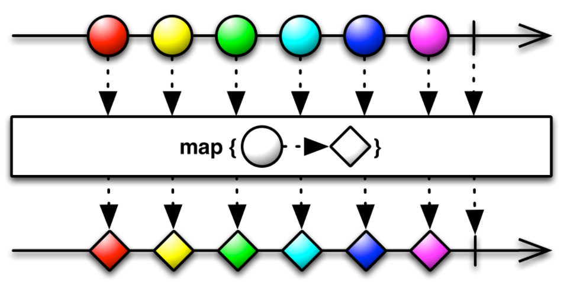
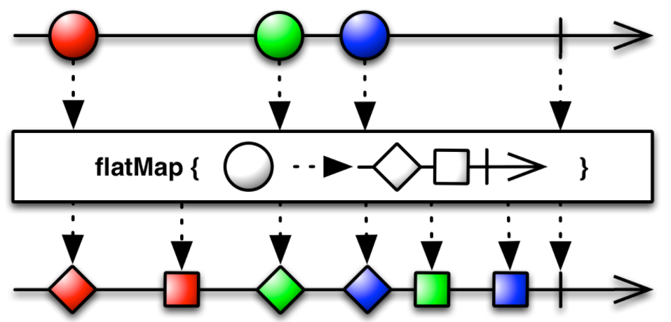

RxJava创建操作符：
 1. create():使用一个函数从头创建一个Observable 
 2. just():将一个或多个对象转成发射这个或这些对象的一个Observable 
 3. from(): 将一个Iterable、一个Future、一个数组转换成一个Observable 
 4. defer(): 只有当观察者订阅才创建Observable，并且为每个观察者创建一个新的Observable 
 5. range():创建一个发射指定范围的整数序列的Observable
 6. interval():创建一个按照给定的时间间隔发射整数序列的Observable
 7. timer():创建一个在给定的延时之后发射单个数据的Observable
 8. empty():创建一个什么都不做直接通知完成的Observable
 9. error():创建一个什么都不做直接通知错误的Observable
10. never():创建一个不发射任何数据的Observable
11. repeat(): 创建一个发射特定数据重复多次的Observable  
   1) repeat():无限重
   2) repeat(int n):重复n次
   3) repeatWhen(): 有条件地重新订阅和发射原来的Observable 
  
线程调度器：
computation(): 用于CPU密集的计算任务
io(): 用于I/O密集型任务,支持异步阻塞I/O操作
newThread(): 为每个任务创建一个新线程
single():拥有一个线程单例,所有任务都在这一个线程中执行.当此线程有任务执行时,它的任务将会按照先进先出的顺序依次执行

subscribeOn(): 通过接收一个Scheduler参数，来指定对数据的处理运行在特定的线程调度器Scheduler上。
               若多次设定，则只有一次起作用
observerOn(): 接收一个Scheduler参数，来指定下游操作运行在特定的线程调度器Scheduler上。
              若多次设定，每次均起作用
              

变换操作符合过滤操作符
  * map操作符: 对Observable发射的每一项数据应用一个函数，执行变换操作 
     
  * flatMap 操作符: 将一个发射数据的Observable变换为多个Observables，然后将它们发射的数据合并后放进一个单独的Observable
                    